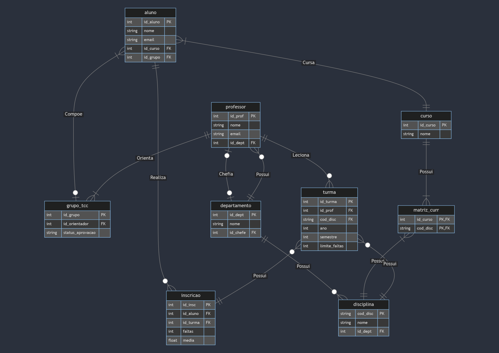

<h1> Projeto de Banco de Dados</h1>
Este repositório contém o projeto da disciplina de Banco de Dados CC5232 da universidade FEI. O objetivo deste se dá na construção de um banco de dados relacional para uma faculdade convencional.
  
Para a realização deste trabalho, foi utilizado a plataforma serverless https://www.cockroachlabs.com/, logo, é recomendado a utilização do mesmo para garantir os mesmos resultados. De maneira alternativa, é possível utilizar o SGBDR PosgreSQL localmente para a criação do banco de dados.

<h2>Diagrama de Relacionamento</h2>

<h2> Instruções </h2>
Após a criação de seu cluster ou seu banco local, basta executar o script "creates.sql" para criar o schema do banco de dados.
  
Após a execução, é necessário que seja executado o script "gera_dados.py", trocando as variáveis no início necessárias para a conexão com seu banco, gerando assim dados fictícios para teste.
  
Para vizualização das informações especificadas nos detalhes do projeto, basta procurar no arquivo "queries.sql" e executar em seu software de preferência.
 

<h2> Dependências </h2>
sqlalchemy-cockroachdb 
sqlalchemy 
Faker 

<h2>Integrantes</h2>
<table>
  <tr>
    <th>Nome </th>
    <th>RA</th>
  </tr>
  <tr>
    <td>Yuri Bykoff</td>
    <td>22.121.045-3</td>
  </tr>
  <tr>
    <td>Daniel Eiji Osato Yoshida</td>
    <td>22.121.131-1</td>
  </tr>
  <tr>
    <td>Igor Vicente Cutalo</td>
    <td>22.123.062-6</td>
  </tr>
</table>
